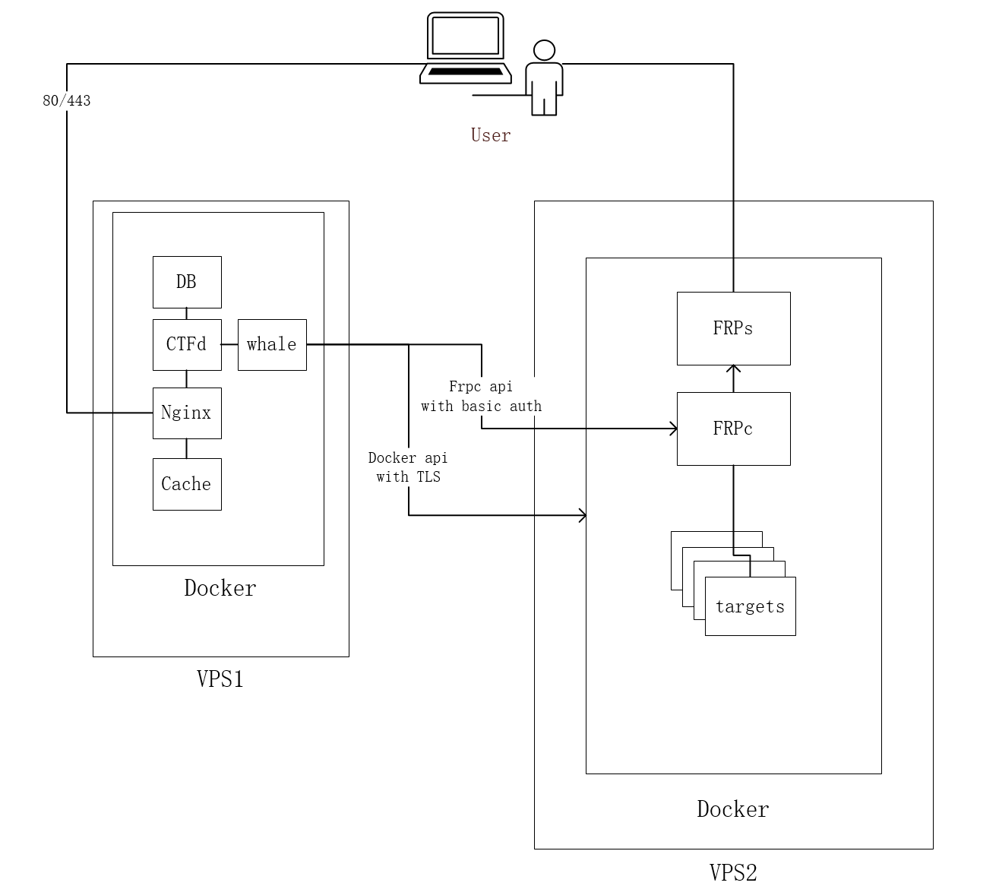
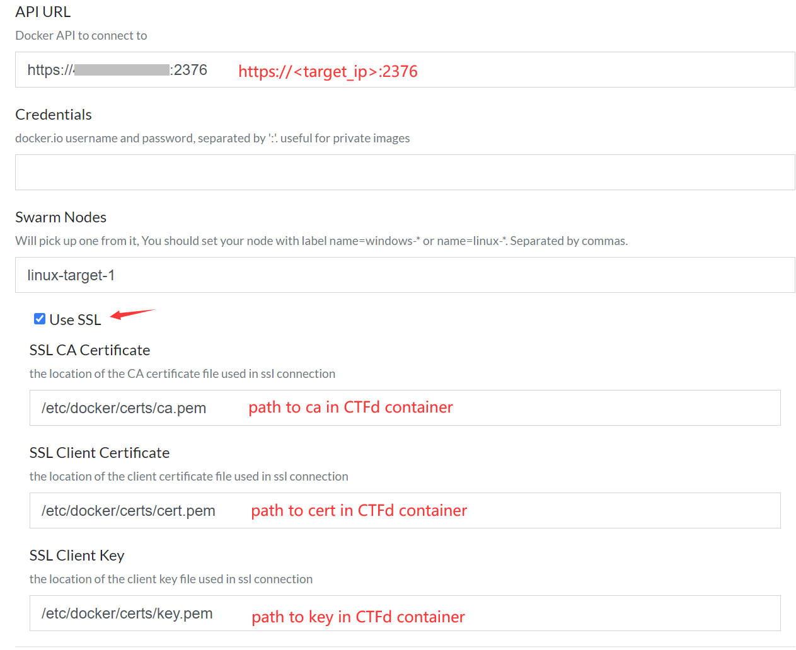
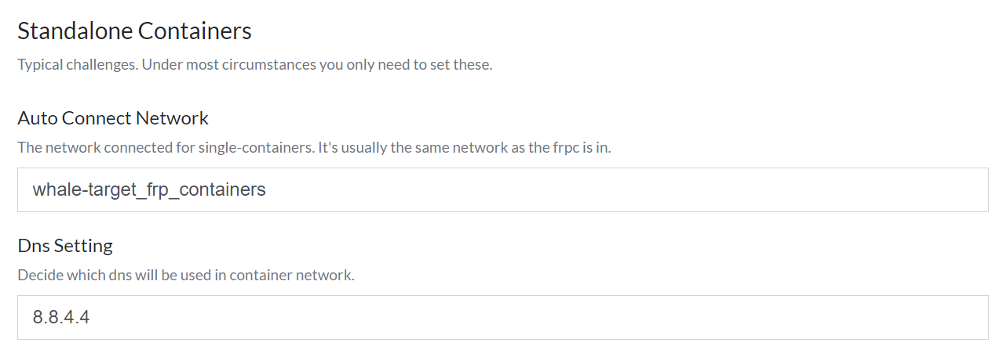
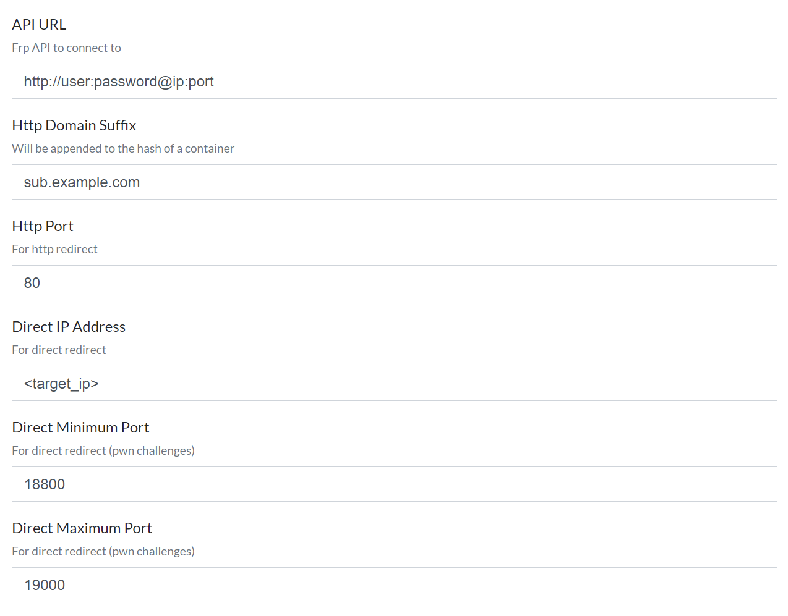

# Advanced deployment

## Note

Please make sure that you have experienced the installation process on single node. This deployment method is *NOT* recommended on first try.

It would be easy for you to understand what we are going to do if you have some experience in using `docker` and `frp`.

## Goal

The goal of this advanced deployment is to deploy the CTFd and challenge containers on seperate machines for better experiences.

Overall, `ctfd-whale` can be decomposed into three compnents: `CTFd`, challenge containers along with frpc, and frps itself. The three components can be deployed seperately or together to satisfy different needs.

For example, if you're in a school or an organization that has a number of high-performance dedicated server *BUT* no public IP for public access, you can refer to this tutorial.

Here are some options:

* deploy frps on a server with public access
* deploy challenge containers on a seperate sever by joining the server into the swarm you created earlier
* deploy challenge containers on *rootless* docker
* deploy challenge containers on a remote server with public access, *securely*

You could achieve the first option with little effort by deploying the frps on the server and configure frpc with a different `server_addr`.
In a swarm with multiple nodes, you can configure CTFd to start challenge containers on nodes you specifies randomly. Just make sure the node `whale` controlls is a `Leader`. This is not covered in this guide. You'll find it rather simple, even if you have zero experience on docker swarm.
The [Docker docs](https://docs.docker.com/engine/security/rootless/) have a detailed introduction on how to set up a rootless docker, so it's also not covered in this guide.

In following paragraphs, the last option is introduced.

## Architecture

In this tutorial, we have 2 separate machines which we'll call them `web` and `target` server later. We will deploy CTFd on `web` and challenge containers (along with frp) on `target`.

This picture shows a brief glance.



---

### Operate on `target` server

> root user is NOT recommended
> if you want to expose your docker deployment, you might also want to use [rootless docker](https://docs.docker.com/engine/security/rootless/)

Please read the [Docker docs](https://docs.docker.com/engine/security/protect-access/#use-tls-https-to-protect-the-docker-daemon-socket) thoroughly before continuing.

Setup docker swarm and clone this repo as described in [installation](./install.md), then follow the steps described in the Docker docs to sign your certificates.

> protect your certificates carefully
> one can take over the user running `dockerd` effortlessly with them
> and in most cases, the user is, unfortunately, root.

You can now create a network for your challenges by executing

```bash
docker network create --driver overlay --attachable challenges
```

Then setup frp on this machine. You might want to setup frps first:

```bash
# change to the version you prefer
wget https://github.com/fatedier/frp/releases/download/v0.37.0/frp_0.37.0_linux_amd64.tar.gz
tar xzvf frp_0.37.0_linux_amd64.tar.gz
cd frp_0.37.0_linux_amd64
mkdir /etc/frp
configure_frps frps.ini  # refer to [installation](./install.md)
cp systemd/frps.service /etc/systemd/system
systemctl daemon-reload
systemctl enable frps
systemctl start frps
```

Then frpc. Frpc should be running in the same network with the challenge containers, so make sure you connect frpc to the network you just created.

```bash
docker run -it --restart=always -d  --network challenges -p 7400:7400 frankli0324/frp:frpc \
    --server_addr=host_ip:host_port \
    --server_port=7000 \
    --admin_addr=7400 \
    --admin_port=7400 \
    --admin_user=username \
    --admin_pwd=password \
    --token=your_token
```

You could use `docker-compose` for better experience.

Here are some pitfalls or problems you might run into:

#### working with `systemd`

Copy the systemd service file to `/etc/systemd` in order to prevent it from being overwritten by future updates.

```bash
cp /lib/systemd/system/docker.service /etc/systemd/system/docker.service
```

Locate `ExecStart` in the file and change it into something like this:

```systemd
ExecStart=/usr/bin/dockerd \
    --tlsverify \
    --tlscacert=/etc/docker/certs/ca.pem \
    --tlscert=/etc/docker/certs/server-cert.pem \
    --tlskey=/etc/docker/certs/server-key.pem \
    -H tcp://0.0.0.0:2376 \
    -H unix:///var/run/docker.sock
```

Remember to reload `systemd` before restarting `docker.service`

```bash
systemctl daemon-reload
systemctl restart docker
```

#### cloud service providers

Most service providers provides you with a basic virus scanner in their system images, for example, AliCloud images comes with `YunDun`. You might want to disable it. The challenge containers often comes with backdoors, and is often accessed in a way cloud providers don't like (they are obviously attacks).

#### certificate security

Please follow the best practices when signing your certificates. If you gets used to signing both the client and server certicates on a single machine, you might run into troubles in the future.

If you feel inconvenient, at least sign them on your personal computer, and transfer only the needed files to client/server.

#### challenge networks and frpc

You could create an internal network for challenges, but you have to connect frpc to a different network *with* internet in order to map the ports so that CTFd can access the admin interface. Also, make sure frps is accessible by frpc.

### Operate on `web` server

Map your client certificates into docker. You might want to use `docker secrets`. Remember where the files are *inside the container*. In the case which you use `docker secrets`, the directory is `/run/secrets`.

You may also delete everything related to `frp` like `frp_network` since we are not going to run challenge containers on `web` server anymore. But if you just has one public IP for `web` server, you can leave `frps` service running.

Then recreate your containers:

```bash
docker-compose down  # needed for removing unwanted networks
docker-compose up -d
```

Now you can configure CTFd accordingly.
Sample configurations:





refer to [installation](./install.md) for explanations.

---

Now you can add a challenge to test it out.
