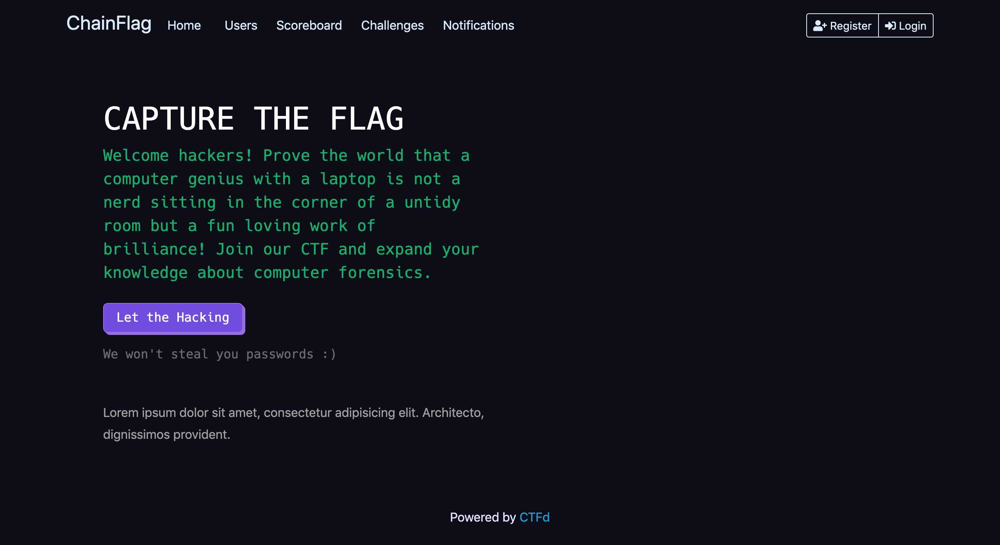
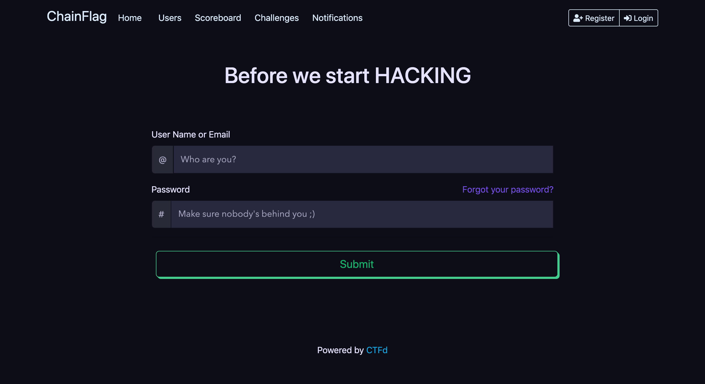

# ctfd-neon-theme
Compatible with CTFd Version 3.4.0

Few Screenshots:

 
 
 

## Install
```
git clone https://github.com/chainflag/ctfd-neon-theme.git CTFd-path/CTFd/themes/neon
```

## Usage
1. Access the CTFd Admin Panel
2. Go to Config > Themes and select neon theme.
3. Go to Pages > All Pages > index and use [index.html](https://github.com/chainflag/ctfd-neon-theme/blob/main/templates/index.html) as index page content

## Credits
* [CTFd](https://github.com/CTFd/CTFd)
* [Neon Glow](https://hackerthemes.com/bootstrap-themes/demo/neon-glow) 
* [PICT-CTF-WEBSITE-FRONTEND](https://github.com/ashawe/PICT-CTF-WEBSITE-FRONTEND)

## License
This project is licensed under the GNU General Public License v2.0